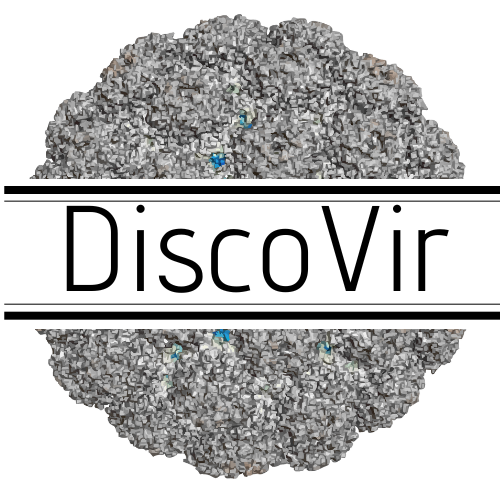
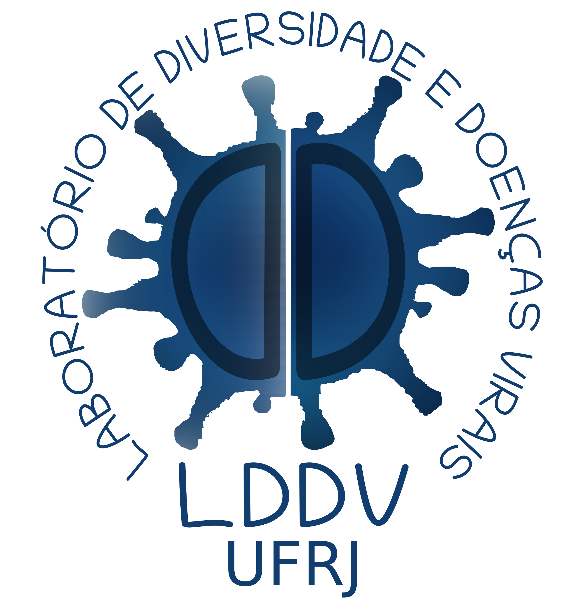

# DiscoVir: Reprodutable Viral Discovery Pipeline

[](https://snakemake.readthedocs.io)
[](workflow/envs/DiscoVir.yaml)
[](https://www.gnu.org/licenses/gpl-3.0)

<p align="center">
  
</p>

---

## Table of Contents

- [Introduction](#introduction)
- [Requirements](#requirements)
- [Installation](#installation)
- [Usage](#usage)
- [Features](#features)
- [Contributing](#contributing)
- [License](#license)
- [Author](#author)

## Introduction

DiscoVir is a comprehensive and scalable Snakemake workflow for the detection of novel viruses within High-Throughput Sequencing (HTS) data. The pipeline is designed to work with both short-read (Illumina) and long-read (Nanopore/PacBio) metagenomic and transcriptomic data.

## Requirements

### Conda Installation
The pipeline uses Conda to manage its dependencies. We recommend having any version of Conda running on your machine. If you don't have Conda installed, you can follow the installation guide for Miniforge at [conda-forge](https://github.com/conda-forge/miniforge).

### Databases
Due to the large size of the databases used and their common presence within HPC clusters, the paths to the databases must be provided before running the pipeline. Their download is not part of this pipeline. If you have any doubts, please open an issue or get in touch with your HPC support team for proper installation.
 - [nr](https://ftp.ncbi.nlm.nih.gov/blast/db/v5/)
 - [Kraken2](https://benlangmead.github.io/aws-indexes/k2)

The `prot.accession2taxid.gz` file, which is used for taxonomic classification, is downloaded automatically by the workflow.

## Installation
The `DiscoVir.sh` script is responsible for managing the run, automatically downloading and creating the necessary Conda environments, as well as managing Conda versions for the pipeline to work.

1.  **Clone the repository:**

```bash
 git clone https://github.com/user/discovir.git
 cd discovir
```

2. **Verify installation:**

```shell
 bash DiscoVir.sh --help 
```

The following must appear on your screen:

 ```yaml
 DiscoVir: Viral Metagenomics & 'Dark Matter' Discovery

 Author: MSc. Matheus Cosentino 
 Version: 12.2025

 Usage:
  bash DiscoVir.sh --input <DIR> --output <DIR> [OPTIONS]

 Required Arguments:
   --input <DIR>        Directory containing raw reads (.fastq.gz) or contigs (.fasta)
   --output <DIR>       Directory where results will be saved

 Optional Arguments:
   --sra <FILE>         Text file containing SRA Accession IDs for download.
   --jobs <INT>         Number of jobs (default: 15)
   --profile <STR>      Snakemake profile (default: profile_slurm)
   --temp-dir <DIR>     Temporary directory (default: /tmp)

 Database Overrides (Use external DBs):
   --diamond_db <FILE>  External Diamond database (.dmnd).
   --kraken2 <DIR>      External Kraken2 database directory (Must contain hash.k2d, opts.k2d, taxo.k2d)

 Module Toggles (Enable/Disable Analysis):
   
- **`--reads-kraken`** <font size="2">*(Default: `False`)*</font>: Enables taxonomic classification of raw reads using Kraken2. This is useful for getting a quick overview of the taxonomic composition of your samples.
- **`--reads-diamond`** <font size="2">*(Default: `False`)*</font>: Enables taxonomic classification of raw reads using DIAMOND. This is a more sensitive alternative to Kraken2, but it is also more computationally intensive.
- **`--assembly`** <font size="2">*(Default: `False`)*</font>: Enable *de novo* assembly of reads into contigs. This is a core step for viral discovery.
- **`--kraken2`** <font size="2">*(Default: `False`)*</font>: Enable taxonomic classification of assembled contigs using Kraken2.
- **`--diamond`** <font size="2">*(Default: `False`)*</font>: Enable taxonomic classification of assembled contigs using DIAMOND. This is the main approach for identifying viral contigs.
- **`--darkmatter`** <font size="2">*(Default: `False`)*</font>: Enable the "dark matter" discovery module, which searches for novel viruses in the contigs that were not identified by DIAMOND. This module uses the `palm_annot` tool to search for RdRp signatures.
- **`--basta`** <font size="2">*(Default: `False`)*</font>: Enable BASTA taxonomic classification of assembled contigs.
- **`--remove-download`** <font size="2">*(Default: `False`)*</font>: Remove the SRA files after they are downloaded. This is useful for saving disk space.

 
 Flags:
   -h, --help           Show this help message
   -v, --version        Show version
```

## Usage
- Kraken2 & Diamond Reads Identification
```shell
bash DiscoVir.sh --input <DIR> --output <DIR> --kraken2 <DIR> --diamond_db <FILE> --reads-kraken --reads-diamond
```

- Kraken2 Only Reads Identification
```shell
bash DiscoVir.sh --input <DIR> --output <DIR>  --kraken2 <DIR> --reads-kraken
```

- Diamond Only Reads Identification
```shell
bash DiscoVir.sh --input <DIR> --output <DIR> --diamond_db <FILE> --reads-diamond
```

### DiscoVir Core Pipeline
After a first round of analysis where the sequencing data demonstrates a satisfactory overall quality, the following command can be used for a further viral discovery pipeline. This process consists of a contig assembly with the spades `viralrna` algorithm (or any other tag or assembler of your preference among the options in the `config.yaml` file), followed by taxonomic identification with Diamond. Contigs without Diamond hits are filtered by size, and Amino Acids generated by ORFs within distinct genetic codes are passed through the [palm_annot](https://github.com/rcedgar/palm_annot.git) RdRp scan scripts. Total virus contigs identified by viral family are reported within an R Markdown script.

```shell
bash DiscoVir.sh --input <DIR> --output <DIR> --diamond --duskmatter 
```

## Features
### Working with Public Data

One of the advantages of the DiscoVir pipeline is the possibility to easily incorporate publicly available data into the discovery pipeline, allowing for an easy process of discovering novel viruses within the public [SRA](https://www.ncbi.nlm.nih.gov/sra/).

For this, a line-separated file (e.g., `accession.txt`) must be provided, where each line corresponds to a Run identifier within SRA.

```yaml
SRR25008973
SRR25008974
SRR25008975
SRR25008976
SRR25008977
```

Once the libraries of interest are given, run the following command to download the files.

```shell
bash DiscoVir.sh --input <DIR> --output <DIR> --sra <FILE> 
```

**Caution**:
After the whole workflow is finished, the data will be kept. If you are interested in deleting the data after the run, use the following command:

```shell
bash DiscoVir.sh --input <DIR> --output <DIR> --sra <FILE> --remove-download 
```

### Oxford Nanopore Sequencing Data

The proposed workflow is capable of dealing with long-read data, such as the HTS files generated by ONP. However, edits to the configuration file must be made due to the variation within the type of reads.

- Adjust the overall quality and size filtering criteria by modifying the relevant parameters for `fastp` inside the `config/config.yaml` file.

```yaml
# QC
fastp:
  length_required: 
    #- 15 # Illumina adapters expected
    - 500 # Nanopore conservative size for low reads
  qualified_quality_phred: 
    #- 30 # Illumina paired-end
    - 10 # Long read
```

After editing, run the commands expected for read analysis according to your interest.

- Kraken2 & Diamond Reads Identification
```shell
bash DiscoVir.sh --input <DIR> --output <DIR> --kraken2 <DIR> --diamond_db <FILE> --reads-kraken --reads-diamond
```

- Kraken2 Only Reads Identification
```shell
bash DiscoVir.sh --input <DIR> --output <DIR>  --kraken2 <DIR> --reads-kraken
```

- Diamond Only Reads Identification
```shell
bash DiscoVir.sh --input <DIR> --output <DIR> --diamond_db <FILE> --reads-diamond
```

### ONP De Novo Assembly

In scenarios where de novo assembly is necessary for ONP data, the following alterations within the `config.yaml` must be done:
 - Activate the tools of interest. Medaka for contig correction is recommended, but correction models vary according to the flowcell and sequencer used.

```yaml
tool:
  denovo: # Select your favorite de novo tools
  # Options: 
   # - 'spades'    # More resources needed, but algorithms to better deal with RNA-seq data of Illumina short reads (default)
   # - 'megahit'    # Indicated for Illumina short reads. Faster, but more error-prone
    - 'flye'       # Indicated for Nanopore sequencing long reads (>1000 bp per read)
   # - 'raven'      # Indicated for Nanopore sequencing. Faster, but more error-prone
    - 'medaka_flye'   # Correction for ONP flye assembly
   # - 'medaka_raven'  # Correction for ONP raven assembly
```

The same process can be made to use the Raven assembly software and Medaka correction, which are also available. Nevertheless, it is worth mentioning that overall contig assembly with ONP reads generates a very low number of contigs.


# Contributing
Contributions are welcome! If you find a bug or have a suggestion for improvement, please open an issue!

# License
This project is licensed under the GNU General Public License v3.0.

# Author
MSc. Matheus Cosentino


---
<div align="center">
  
  
</div>