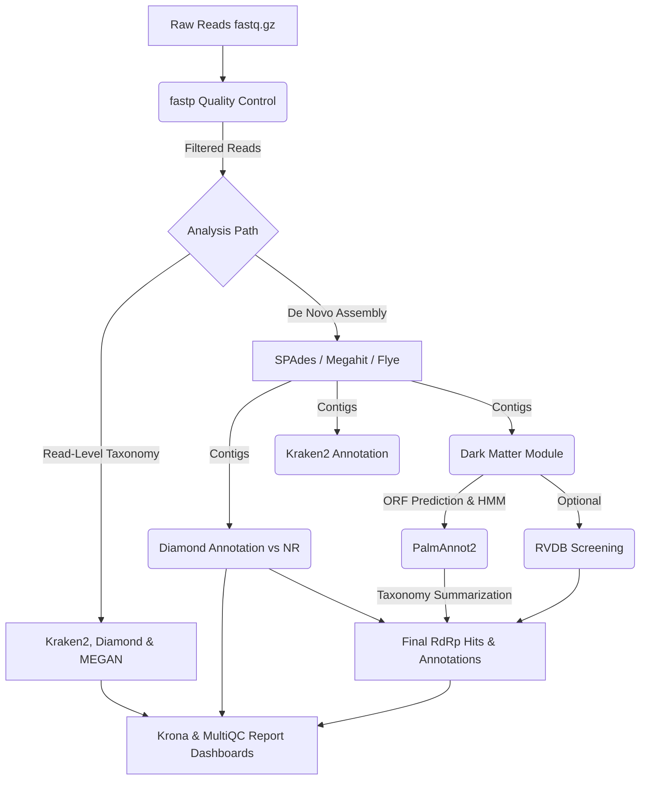

# DiscoVir: Reproducible Viral Discovery Pipeline

[](https://snakemake.readthedocs.io)
[](workflow/envs/DiscoVir.yaml)
[](https://www.gnu.org/licenses/gpl-3.0)

<p align="center">
  
</p>

> [!TIP]
> **New to DiscoVir?** Start with our **[🚀 Local Usage & 1st Time Setup](docs/local_use.md)** to quickly set up Conda, testing databases, and run the pipeline locally.

---

## Table of Contents

- [Introduction](#introduction)
- [Pipeline Presentation](#pipeline-presentation)
- [Requirements & Dependencies](#requirements--dependencies)
- [Installation](#installation)
- [Tutorials & Guides](#tutorials--guides)
- [Contributing](#contributing)
- [License](#license)
- [Author](#author)
- [Contributing](#contributing)
- [License](#license)
- [Author](#author)

## Introduction

DiscoVir is a comprehensive and scalable Snakemake workflow for the detection of novel viruses within High-Throughput Sequencing (HTS) data. The pipeline is designed to work with both short-read (Illumina) and long-read (Nanopore/PacBio) metagenomic and transcriptomic data.

## Pipeline Presentation



## Requirements & Dependencies

### Recommended Hardware Specs
- **Memory (RAM)**: Minimum 32GB (for metaSPAdes assembly). 64GB+ recommended for large meta-transcriptomic datasets.
- **CPU**: 8-16+ cores recommended.
- **Disk Space**: At least 100GB+ available space to download external databases safely on local or HPC clusters.

### Dependencies (Conda & Databases)
The pipeline uses Conda to manage its dependencies automatically.
Database download and formatting (e.g. Kraken2 and Diamond NR) is required before running the pipeline. 

Please see our **[Launching Tutorial (1st Time)](docs/launching_tutorial_1st_time.md)** for detailed instructions on where to get these and how to format them.

## Installation
The `DiscoVir.sh` script is responsible for managing the run, automatically downloading and creating the necessary Conda environments, as well as managing Conda versions for the pipeline to work.

### Reproducibility with Conda
DiscoVir uses Snakemake’s native Conda integration through `--use-conda`. This means that users do not need to manually install the required tools. The workflow automatically creates and uses the exact software environments defined in [workflow/envs](workflow/envs) for each analysis module, ensuring that results are reproducible across different machines and remain consistent even when system-wide software changes.

1.  **Clone the repository:**

```bash
 git clone https://github.com/matheus-cosentino/discovir.git
 cd discovir
```

2. **Verify installation:**

```shell
 bash DiscoVir.sh --help 
```

The following must appear on your screen:

 ```yaml
 DiscoVir: Viral Metagenomics & 'Dark Matter' Discovery

 Author: MSc. Matheus Cosentino 
 Version: 03.2026

 Usage:
  bash DiscoVir.sh --input <DIR> --output <DIR> [OPTIONS]

 Required Arguments:
   --input: <DIR>        Directory containing raw reads (.fastq.gz) or contigs (.fasta)
   --output: <DIR>       Directory where results will be saved

 Optional Arguments:
   --sra: <FILE>         Text file containing SRA Accession IDs for download.
   --jobs: <INT>         Number of jobs (default: 15)
  --profile: profiles/<PROFILE>      Snakemake profile directory under profiles/ (e.g., profiles/profile_slurm)
   --temp-dir: <DIR>     Temporary directory (default: /tmp)

 Database Overrides (Use external DBs):
   --diamond_db: <FILE>  External Diamond database (.dmnd).
   --kraken2: <DIR>      External Kraken2 database directory (Must contain hash.k2d, opts.k2d, taxo.k2d)

 Module Toggles (Enable/Disable Analysis):
   --reads-kraken: Enables taxonomic classification of raw reads using Kraken2.
   --reads-diamond: Enables taxonomic classification of raw reads using DIAMOND and MEGAN LCA analysis.
   --assembly: Enables *de novo* assembly of reads into contigs.
   --kraken2: Enables taxonomic classification of assembled contigs using Kraken2.
   --diamond: Enables taxonomic classification of assembled contigs using DIAMOND.
   --darkmatter: Enables the "dark matter" module to search for RdRp signatures.
   --rvdb: Enables optional RVDB validation on dark matter ORFs.
   --remove-download: Removes SRA files after download.
 
 Flags:
   -h, --help           Show this help message
   -v, --version        Show version
```

## Tutorials & Guides

To make it easier to navigate, we have divided the instructions into specific tutorials based on your usage:

- **[Local Usage & 1st Time Setup](docs/local_use.md)**: Start here! Learn how to install Conda, prepare lightweight test databases, and run DiscoVir on your local machine.
- **[Full Databases Setup](docs/full_databases_setup.md)**: Instructions on how to download and properly format the full massive production databases for Kraken2 and Diamond (NR).
- **[HPC (Slurm) Usage Guide](docs/hpc_use.md)**: Instructions for running the pipeline on an HPC cluster using the Slurm executor.
- **[Advanced Configuration Tutorial](docs/advanced_tutorial.md)**: Practical guidance on assembler selection, SPAdes tuning, and long-read assembly choices.
- **[Working with Public Data (SRA)](docs/public_data_usage.md)**: Learn how to incorporate publicly available sequencing runs (SRA) directly into the pipeline.
- **[Expected Outputs](docs/expected_outputs.md)**: Learn about the file structure generated by the pipeline.
- **[Pipeline Structure & DAGs](docs/structure_and_dags/workflow_structure.md)**: Detailed documentation of the directory structure and the execution DAGs.

# Contributing
Contributions are welcome! If you find a bug or have a suggestion for improvement, please open an issue!

# License
This project is licensed under the GNU General Public License v3.0.

# Author
MSc. Matheus Cosentino


---
<div align="center">
  
  
</div>