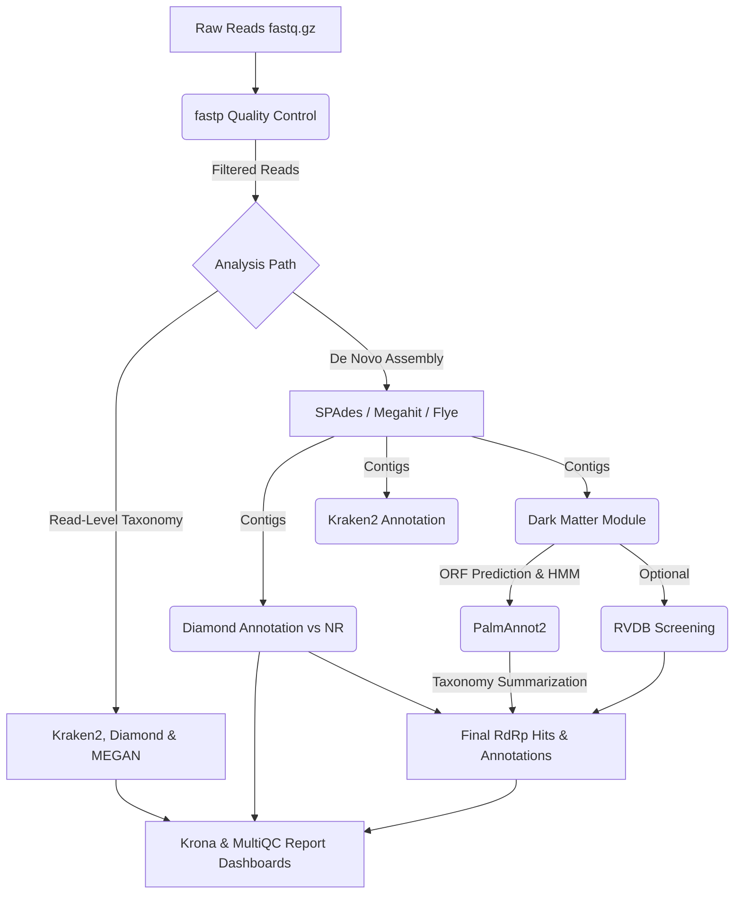
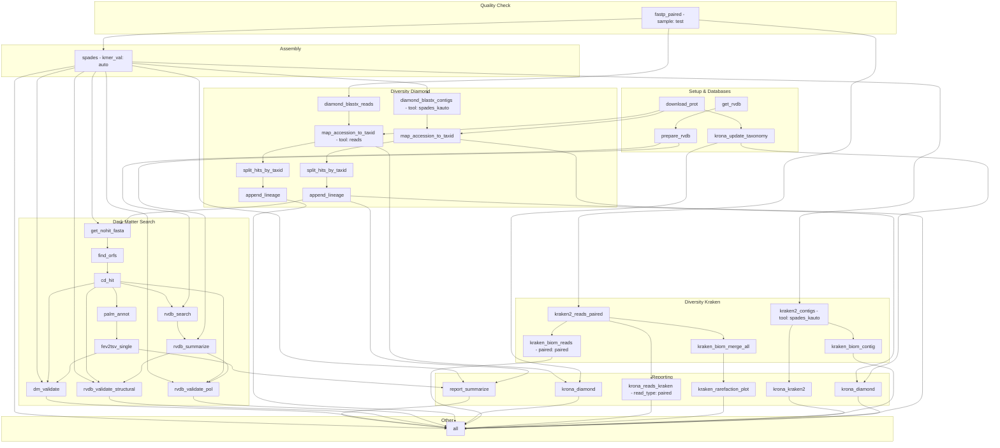

# DiscoVir: Reproducible Viral Discovery Pipeline

[](https://snakemake.readthedocs.io)
[](workflow/envs/DiscoVir.yaml)
[](https://www.gnu.org/licenses/gpl-3.0)

<p align="center">
  
</p>

---

## Table of Contents

- [Introduction](#introduction)
- [Pipeline Presentation](#pipeline-presentation)
- [Requirements](#requirements)
- [Installation](#installation)
- [Basic Local Usage](#basic-local-usage)
- [Advanced Configuration Tutorial](#advanced-configuration-tutorial)
- [Diversity Modules](#diversity-modules)
- [Dark Matter Modules](#dark-matter-modules)
- [Expected Outputs](#expected-outputs)
- [Features](#features)
- [Contributing](#contributing)
- [License](#license)
- [Author](#author)

## Introduction

DiscoVir is a comprehensive and scalable Snakemake workflow for the detection of novel viruses within High-Throughput Sequencing (HTS) data. The pipeline is designed to work with both short-read (Illumina) and long-read (Nanopore/PacBio) metagenomic and transcriptomic data.

## Pipeline Presentation



## Requirements

### Recommended Hardware Specs
- **Memory (RAM)**: Minimum 32GB (for metaSPAdes assembly). 64GB+ recommended for large meta-transcriptomic datasets.
- **CPU**: 8-16+ cores recommended.
- **Disk Space**: At least 100GB+ available space to download external databases safely on local or HPC clusters.

### Conda Installation
The pipeline uses Conda to manage its dependencies. We recommend having any version of Conda running on your machine. If you don't have Conda installed, you can follow the installation guide for Miniforge at [conda-forge](https://github.com/conda-forge/miniforge).

### Databases
Due to the large size of the databases used and their common presence within HPC clusters, the paths to the databases must be provided before running the pipeline. Their download is not part of this pipeline. If you have any doubts, please open an issue or get in touch with your HPC support team for proper installation.
 - [nr](https://ftp.ncbi.nlm.nih.gov/blast/db/v5/) (For Diamond)
 - [Kraken2](https://benlangmead.github.io/aws-indexes/k2)

## Installation
The `DiscoVir.sh` script is responsible for managing the run, automatically downloading and creating the necessary Conda environments, as well as managing Conda versions for the pipeline to work.

### Reproducibility with Conda
DiscoVir uses Snakemake’s native Conda integration through `--use-conda`. This means that users do not need to manually install the required tools. The workflow automatically creates and uses the exact software environments defined in [workflow/envs](workflow/envs) for each analysis module, ensuring that results are reproducible across different machines and remain consistent even when system-wide software changes.

1.  **Clone the repository:**

```bash
 git clone https://github.com/matheus-cosentino/discovir.git
 cd discovir
```

2. **Verify installation:**

```shell
 bash DiscoVir.sh --help 
```

The following must appear on your screen:

 ```yaml
 DiscoVir: Viral Metagenomics & 'Dark Matter' Discovery

 Author: MSc. Matheus Cosentino 
 Version: 03.2026

 Usage:
  bash DiscoVir.sh --input <DIR> --output <DIR> [OPTIONS]

 Required Arguments:
   --input: <DIR>        Directory containing raw reads (.fastq.gz) or contigs (.fasta)
   --output: <DIR>       Directory where results will be saved

 Optional Arguments:
   --sra: <FILE>         Text file containing SRA Accession IDs for download.
   --jobs: <INT>         Number of jobs (default: 15)
  --profile: profiles/<PROFILE>      Snakemake profile directory under profiles/ (e.g., profiles/profile_slurm)
   --temp-dir: <DIR>     Temporary directory (default: /tmp)

 Database Overrides (Use external DBs):
   --diamond_db: <FILE>  External Diamond database (.dmnd).
   --kraken2: <DIR>      External Kraken2 database directory (Must contain hash.k2d, opts.k2d, taxo.k2d)

 Module Toggles (Enable/Disable Analysis):
   --reads-kraken: Enables taxonomic classification of raw reads using Kraken2.
   --reads-diamond: Enables taxonomic classification of raw reads using DIAMOND and MEGAN LCA analysis.
   --assembly: Enables *de novo* assembly of reads into contigs.
   --kraken2: Enables taxonomic classification of assembled contigs using Kraken2.
   --diamond: Enables taxonomic classification of assembled contigs using DIAMOND.
   --darkmatter: Enables the "dark matter" module to search for RdRp signatures.
   --rvdb: Enables optional RVDB validation on dark matter ORFs.
   --remove-download: Removes SRA files after download.
 
 Flags:
   -h, --help           Show this help message
   -v, --version        Show version
```

## Basic Local Usage

### Core Concepts for First-Time Users

DiscoVir's design is highly modular. The use of specific **flags** triggers different modules with distinct purposes and computational requirements:

If you want to tune preprocessing and assembly parameters, see the dedicated tutorial at [docs/advanced-configuration-tutorial.md](docs/advanced-configuration-tutorial.md).

### Advanced Configuration Tutorial

For practical guidance on fastp, assembler selection, SPAdes tuning and long-read assembly choices, please refer to [docs/advanced-configuration-tutorial.md](docs/advanced-configuration-tutorial.md).

- **Initial Evaluation (`--reads-kraken`, `--reads-diamond`)**: These modules operate directly on raw reads. They serve as a rapid, initial evaluation of your pipeline and sample composition, allowing you to gauge the presence of viral content without heavy computation. `--reads-diamond` automatically includes MEGAN LCA summarization.
- **Deep Viral Discovery (`--kraken2`, `--diamond`, `--darkmatter`)**: These modules heavily depend on the prior *de novo* assembly of your reads (`--assembly` is usually implicitly run or required). Because they operate on assembled contigs and search for novel sequences, they focus on more computational power and time, yielding highly specific viral insights.
- **Optional RVDB Validation (`--rvdb`)**: When enabled, RVDB screening is added to the dark matter workflow to further evaluate ORFs and assembled contigs with an RVDB HMM database. It is disabled by default and does not need to run with dark matter unless requested.
- **Resource Management (`--profile`)**: **The profile flag is key** to running DiscoVir successfully. It identifies the type of computational resources (CPU, Memory, Time) required for each specific rule. Properly setting your `--profile` (e.g., local execution vs. HPC Slurm) is essential for a smooth first-time experience.

### Basic HPC Slurm Usage

For cluster environments, use the Slurm profile so each rule receives the correct CPU, memory and time limits. A typical invocation is:

```shell
bash DiscoVir.sh --input <DIR> --output <DIR> --profile profiles/profile_slurm --diamond --darkmatter --jobs 20
```

If you want to add the optional RVDB validation on top of dark matter analysis, append:

```shell
--rvdb
```

### Execution DAG

Below is the visual DAG of execution for your pipeline based on your exact `profiles/profile_slurm` run configuration logic.




### Example Workflows

- **Initial Evaluation: Kraken2 & Diamond Reads Identification**
```shell
bash DiscoVir.sh --input <DIR> --output <DIR> --profile profiles/profile_slurm --kraken2 <DIR> --diamond_db <FILE> --reads-kraken --reads-diamond
```

- **Initial Evaluation: Kraken2 Only Reads Identification**
```shell
bash DiscoVir.sh --input <DIR> --output <DIR> --profile profiles/profile_slurm --kraken2 <DIR> --reads-kraken
```

- **Initial Evaluation: Diamond Only Reads Identification**
```shell
bash DiscoVir.sh --input <DIR> --output <DIR> --profile profiles/profile_slurm --diamond_db <FILE> --reads-diamond
```

### DiscoVir Core Pipeline (Assembly & Discovery)
After a rapid initial analysis demonstrates satisfactory overall quality, the following command can be used for the deep viral discovery pipeline. This process requires more computational power and consists of a contig assembly with the SPAdes `viralrna` algorithm (or any requested assembler in `config.yaml`), followed by taxonomic identification. 

Contigs without Diamond hits are filtered by size, and amino-acid sequences generated by ORFs within distinct genetic codes are passed through the [palm_annot](https://github.com/rcedgar/palm_annot.git) RdRp scan scripts. Viral contigs identified by viral family are reported within an R Markdown workflow, together with palm_annot results. RVDB validation is available as an optional extra module through the `--rvdb` flag.

```shell
bash DiscoVir.sh --input <DIR> --output <DIR> --profile profiles/profile_slurm --diamond --darkmatter
```

For the optional RVDB validation step, add:

```shell
bash DiscoVir.sh --input <DIR> --output <DIR> --profile profiles/profile_slurm --diamond --darkmatter --rvdb
```

## Diversity Modules

The diversity modules are intended for taxonomic profiling and broad ecosystem characterization. They are useful when you want to understand which organisms are present in your samples or when you want a fast first-pass assessment before running deeper assembly-based discovery.

### Read-Level Diversity
Use these flags when you want to profile the raw reads directly:

- `--reads-kraken`: performs Kraken2 taxonomic classification on the input reads.
- `--reads-diamond`: performs DIAMOND classification against the NR database on the input reads, and automatically runs MEGAN LCA summarization to produce a `.megan` summary file.

Example:

```shell
bash DiscoVir.sh --input <DIR> --output <DIR> --profile local --reads-kraken --reads-diamond
```

### Assembly-Based Diversity
Use these flags when you want to profile assembled contigs and identify candidate viral signals after assembly:

- `--assembly`: runs de novo assembly of reads into contigs.
- `--kraken2`: classifies the assembled contigs with Kraken2.
- `--diamond`: classifies the assembled contigs with DIAMOND.

Example:

```shell
bash DiscoVir.sh --input <DIR> --output <DIR> --profile local --assembly --kraken2 --diamond
```

## Dark Matter Modules

The dark matter modules are designed for the discovery of novel or divergent viral sequences that may not be captured by standard taxonomic annotations. They operate mainly on assembled contigs and focus on putative RdRp-like candidates.

### Core Dark Matter Analysis
Enable the core dark matter workflow with:

```shell
--darkmatter
```

This step runs ORF finding, palm_annot screening and the downstream reporting workflow for putative dark-matter candidates.

### Optional RVDB Validation
If you want to add RVDB-based validation to the dark matter analysis, enable:

```shell
--rvdb
```

This is optional and does not need to be combined with dark matter unless you explicitly want the additional RVDB screening step.

## Expected Outputs

Once successfully executed, DiscoVir cleanly organizes your results within your standard `--output` directories. Below is a generic overview of an assembled mapping workflow:

```text
results/
├── kraken2_all/                   # Merged Kraken2 outputs and Alpha-Diversity
│   ├── all_samples.biom           # Biom format table encompassing all evaluated samples
│   ├── Rarefaction_Curve.pdf      # Visual plot depicting species richness estimates
│   └── OTU_table.tab              # Tabular format of the operational taxonomic units
├── SRR10677983/
│   ├── log/                       # Sample-specific execution logs
│   ├── fastp/                     # QC & Trimmed adapter reports
│   │   ├── SRR10677983_unp.html                          # Fastp interactive HTML report
│   │   └── SRR10677983_unp.json                          # Fastp metrics in JSON format
│   ├── kraken2_reads/             # Fast Kraken2 taxonomic classification on reads
│   │   ├── SRR10677983_paired_reads_report.txt           # Standard Kraken2 taxonomic report for paired reads
│   │   ├── SRR10677983_paired_reads_output.txt           # Detailed per-read classification output for paired reads
│   │   ├── SRR10677983_paired_reads_biom.txt             # Kraken2 results in BIOM format for paired reads
│   │   ├── SRR10677983_unpaired_reads_report.txt         # Standard Kraken2 taxonomic report for unpaired reads
│   │   ├── SRR10677983_unpaired_reads_output.txt         # Detailed per-read classification output for unpaired reads
│   │   └── SRR10677983_unpaired_reads_biom.txt           # Kraken2 results in BIOM format for unpaired reads
│   ├── diamond_reads/             # Diamond reads classification outputs
│   │   ├── SRR10677983_reads_report.daa                  # DIAMOND alignment in DAA format (intermediate)
│   │   ├── SRR10677983_reads_report.txt                  # Tabular alignment results (outfmt 6)
│   │   └── SRR10677983_reads_hits_with_lineage.tsv       # Diamond hits with full NCBI lineage
│   ├── megan_reads/               # MEGAN Last Common Ancestor taxonomic classification
│   │   └── SRR10677983_reads_summary.megan               # Extracted MEGAN summary table
│   ├── spades/                    # Assembled Fasta contigs
│   │   └── kmer_auto/             # De Novo Assemblage done by SPAdes auto kmer definition           
│   │       └── contigs.fasta                             # Final assembled contigs in FASTA format
│   ├── diamond_spades_kauto/      # Annotated Diamond outputs vs NR
│   │   ├── diamond.log                                   # DIAMOND alignment execution log
│   │   ├── SRR10677983_spades_kauto_report.txt           # Standard alignment report against NR database
│   │   ├── SRR10677983_spades_kauto_hits_with_taxid.tmp  # Intermediate file matching hits with Taxonomic IDs
│   │   ├── SRR10677983_spades_kauto_hits_with_header.tsv # Alignment hits with informative tab-separated headers
│   │   ├── SRR10677983_spades_kauto_hits_no_lineage.temp # Intermediate file before assigning NCBI full lineage
│   │   └── SRR10677983_spades_kauto_hits_with_lineage.tsv # Final comprehensive DIAMOND alignment results with NCBI lineages
│   ├── kraken2_spades_kauto/      # Fast Kraken2 K-mer validations
│   │   ├── SRR10677983_spades_kauto_contig_report.txt    # Standard Kraken2 report for the assembled contigs
│   │   ├── SRR10677983_spades_kauto_contig_output.txt    # Detailed per-contig classification output
│   │   └── SRR10677983_spades_kauto_contig_biom.txt      # Contig taxonomic distribution in BIOM format
│   ├── rvdb_spades_kauto/         # RVDB Summaries containing precise NCBI translation
│   │   ├── SRR10677983_RVDB_results.tsv                  # Primary tabular results evaluated against RVDB
│   │   ├── SRR10677983_RVDB_Summary.csv                  # Aggregated CSV summary report of RVDB profile alignments
│   │   ├── SRR10677983_structural_Orfs.fasta             # ORFs translated from hits to viral structural proteins 
│   │   ├── SRR10677983_structural_contigs.fasta          # Original nucleotide contigs mapped to viral structural proteins
│   │   ├── SRR10677983_pol_Orfs.fasta                    # ORFs translated from hits to viral polymerase proteins
│   │   └── SRR10677983_pol_contigs.fasta                 # Original nucleotide contigs mapped to viral polymerase proteins
│   ├── darkmatter_spades_kauto/   # ORFs & Filtered RdRp viral candidates!
│   │   ├── SRR10677983_ORFs.fasta                        # Multi-table translated ORFs from unmapped contigs
│   │   ├── SRR10677983_RdRp.fev                          # Palmprint raw structural feature evaluation hits
│   │   ├── SRR10677983_RdRp.fasta                        # Sequence data of putative RdRp alignments
│   │   ├── SRR10677983_RdRp.tsv                          # Tabular summary of RdRp predictions
│   │   ├── SRR10677983_Report_Diversity.html             # Comprehensive interactive RMarkdown HTML report
│   │   ├── SRR10677983_contigs_summary.tsv               # Assembly length metrics (Mean, Quartiles, etc.)
│   │   ├── SRR10677983_contigs_summary_per_Kingdom.tsv   # Contig taxonomic breakdown at Kingdom level
│   │   ├── SRR10677983_KINGDOM_Classification_Log10.png  # Barplot comparing Kingdom-level hits
│   │   ├── SRR10677983_Viral_Diamond.tsv                 # Subset of Diamond hits assigned to Viruses
│   │   ├── SRR10677983_Virus_Classification_Log10.png    # Barplot of Viral Family diversity
│   │   ├── SRR10677983_viral_contigs_summary.tsv         # Assembly metrics exclusively for viral families
│   │   ├── SRR10677983_{Family_Name}.fasta               # Disaggregated contigs per viral family (e.g., Flaviviridae)
│   │   ├── SRR10677983_{query}RdRp_Motifs.png            # Palmprint RdRp motif visual diagrams layout per hit
│   │   ├── SRR10677983_RdRp_Orfs.fasta                   # Filtered FASTA containing only target RdRp ORFs
│   │   └── SRR10677983_RdRp_contigs.fasta                # Original nucleotide contigs embedding the RdRp hit
│   └── krona_spades_kauto/        # Interactive HTML plots of relative abundances
│       ├── SRR10677983_spades_kauto_kraken2_krona.html   # Interactive Krona chart for Kraken2 taxonomy
│       └── SRR10677983_spades_kauto_diamond_krona.html   # Interactive Krona chart for DIAMOND taxonomy
├── multiqc_report.html            # Aggregated sequencing QC metrics dashboard
├── multiqc_data/                  # Exported MultiQC data directory
└── stats/                        # Per-sample and per-tool summary statistics for assembly, diamond, kraken2 and dark matter
```


## Features
### Working with Public Data

One of the advantages of the DiscoVir pipeline is the possibility to easily incorporate publicly available data into the discovery pipeline, allowing for an easy process of discovering novel viruses within the public [SRA](https://www.ncbi.nlm.nih.gov/sra/).

For this, a line-separated file (e.g., `accession.txt`) must be provided, where each line corresponds to a Run identifier within SRA.

```yaml
SRR25008973
SRR25008974
SRR25008975
SRR25008976
SRR25008977
```

Once the libraries of interest are given, run the following command to download the files.

```shell
bash DiscoVir.sh --input <DIR> --output <DIR> --sra <FILE> 
```

**Caution**:
After the whole workflow is finished, the data will be kept. If you are interested in deleting the data after the run, use the following command:

```shell
bash DiscoVir.sh --input <DIR> --output <DIR> --sra <FILE> --remove-download 
```

# Contributing
Contributions are welcome! If you find a bug or have a suggestion for improvement, please open an issue!

# License
This project is licensed under the GNU General Public License v3.0.

# Author
MSc. Matheus Cosentino


---
<div align="center">
  
  
</div>