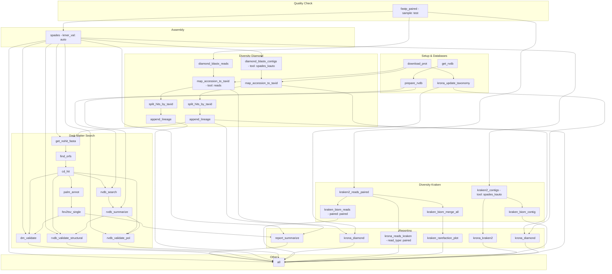

# Pipeline Structure Update Walkthrough

I have successfully updated the output paths across the pipeline to match the desired folder structure exactly, while maintaining the dynamic logic required for multi-tool support (like `spades` and `kauto`).

## New Pipeline Directory Structure

Here is the structured representation of all logs, intermediate files, final contigs, and unified aggregated results generated across the **entire `DiscoVir` pipeline**, conforming strictly to the layout defined in the documentation, including the specific files generated by each rule:

```text
results/
├── log/                           # Main execution logs
├── {sample}/                      # E.g., SRR10677983
│   ├── fastp/                     # QC & Trimmed adapter reports
│   │   ├── {sample}_1.fastq.gz
│   │   ├── {sample}_2.fastq.gz
│   │   ├── {sample}_unp.fastq.gz
│   │   ├── {sample}_unp.html
│   │   └── {sample}_unp.json
│   ├── spades/                    # Assembled Fasta contigs
│   │   └── kmer_auto/
│   │       └── contigs.fasta          # (or assembly.fasta / final.contigs.fa)
│   ├── diamond_{tool}/            # Annotated Diamond outputs vs NR
│   │   ├── diamond.log
│   │   ├── {sample}_{tool}_report.txt
│   │   ├── {sample}_{tool}_hits_with_taxid.tmp
│   │   ├── {sample}_{tool}_hits_with_header.tsv
│   │   ├── {sample}_{tool}_hits_no_lineage.temp
│   │   └── {sample}_{tool}_hits_with_lineage.tsv
│   ├── kraken2_{tool}/            # Fast Kraken2 K-mer validations
│   │   ├── {sample}_{tool}_contig_report.txt
│   │   ├── {sample}_{tool}_contig_output.txt
│   │   └── {sample}_{tool}_contig_biom.txt
│   ├── kraken2_reads/             # Fast Kraken2 K-mer validations from Raw Reads
│   │   ├── {sample}_paired_reads_report.txt
│   │   ├── {sample}_paired_reads_output.txt
│   │   ├── {sample}_unpaired_reads_report.txt
│   │   ├── {sample}_unpaired_reads_output.txt
│   │   └── {sample}_{paired}_reads_biom.txt
│   ├── rvdb_{tool}/               # RVDB Summaries containing precise NCBI translation
│   │   ├── {sample}_RVDB_results.tsv
│   │   ├── {sample}_RVDB_Summary.csv
│   │   ├── {sample}_structural_Orfs.fasta
│   │   ├── {sample}_structural_contigs.fasta
│   │   ├── {sample}_pol_Orfs.fasta
│   │   └── {sample}_pol_contigs.fasta
│   ├── darkmatter_{tool}/         # ORFs & Filtered RdRp viral candidates
│   │   ├── {sample}_ORFs.fasta                   # Multi-table translated ORFs from unmapped contigs
│   │   ├── {sample}_RdRp.fev                     # Palmprint raw structural feature evaluation hits
│   │   ├── {sample}_RdRp.fasta                   # Sequence data of putative RdRp alignments
│   │   ├── {sample}_RdRp.tsv                     # Tabular summary of RdRp predictions
│   │   ├── {sample}_Report_Diversity.html        # Comprehensive interactive RMarkdown HTML report
│   │   ├── {sample}_contigs_summary.tsv          # Assembly length metrics (Mean, Quartiles, etc.)
│   │   ├── {sample}_contigs_summary_per_Kingdom.tsv   # Contig taxonomic breakdown at Kingdom level
│   │   ├── {sample}_KINGDOM_Classification_Log10.png  # Barplot comparing Kingdom-level hits
│   │   ├── {sample}_Viral_Diamond.tsv            # Subset of Diamond hits assigned to Viruses
│   │   ├── {sample}_Virus_Classification_Log10.png    # Barplot of Viral Family diversity
│   │   ├── {sample}_viral_contigs_summary.tsv    # Assembly metrics exclusively for viral families
│   │   ├── {sample}_{Family_Name}.fasta          # Disaggregated contigs per viral family (e.g., Flaviviridae)
│   │   ├── {sample}_{query}RdRp_Motifs.png       # Palmprint RdRp motif visual diagrams layout per hit
│   │   ├── {sample}_RdRp_Orfs.fasta              # Filtered FASTA containing only target RdRp ORFs
│   │   └── {sample}_RdRp_contigs.fasta           # Original nucleotide contigs embedding the RdRp hit
│   ├── krona_{tool}/              # Interactive HTML plots of relative abundances
│   │   ├── {sample}_{tool}_kraken2_krona.html
│   │   └── {sample}_{tool}_diamond_krona.html
│   └── krona_reads/               # Interactive HTML plots for Kraken Reads
│       └── {sample}_{read_type}_kraken2_krona.html
├── kraken2_all/                   # Merged Kraken BIOM matrices and Rarefaction curves
│   ├── all_samples.biom
│   ├── Rarefaction_Curve.pdf
│   └── OTU_table.tab
├── multiqc_data/                  # Raw statistics exported from MultiQC
│   └── multiqc_data.json          # (along with other multiqc outputs)
└── multiqc_report.html            # Aggregated sequencing QC metrics dashboard
```

## Visualization of the Execution DAG

Below is the visual DAG of execution for your pipeline based on your exact `profiles/itrop` run configuration logic.



## Summary of Completed Tasks

> [!NOTE] 
> Below is a brief highlight of the modifications applied across the workspace scripts.

1.  **Fastp Unification:**
    *   Renamed the `trimmed/` directory to `fastp/` across `fastp.smk`, `kraken2.smk`, and the path getters in `functions.py`.

2.  **Dark Matter Unification:**
    *   Merged the old `darkmatter_report_{tool}/` and `darkmatter_to_validate_{tool}/` paths into a unified `darkmatter_{tool}/` folder in `darkmatter.smk`.

3.  **RVDB Search Unification:**
    *   Merged `rvdb_structural_{tool}/` and `rvdb_pol_{tool}/` into a unified `rvdb_{tool}/` block inside `RVDB.smk`. 

4.  **Krona & MultiQC Alignment:**
    *   Moved `multiqc` reports out of `.sample` folders into the root `/results`. This correctly builds interactive aggregated HTML outputs outside of sample constraints.
    *   Restored `krona_{tool}/` and `krona_reads/` directories to isolate output back inside the local `{sample}` folder.
