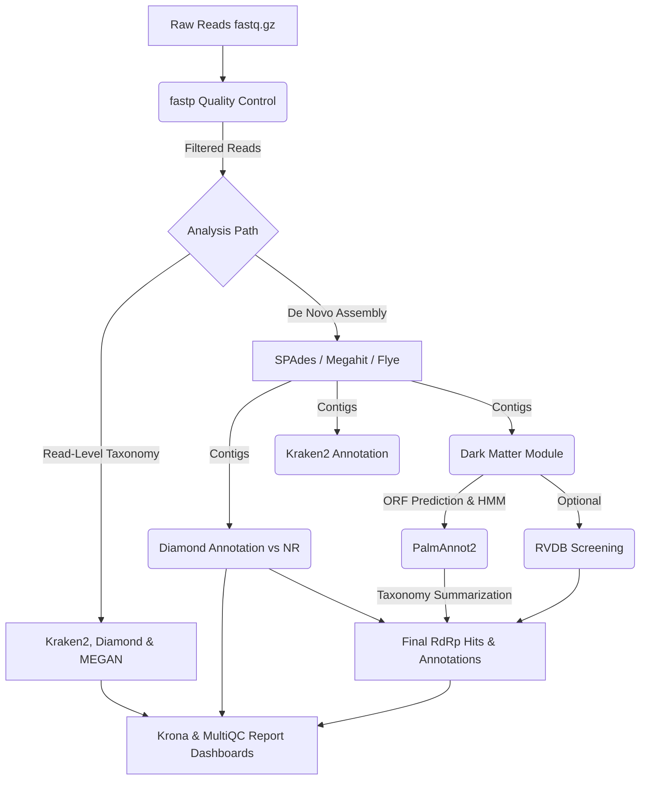
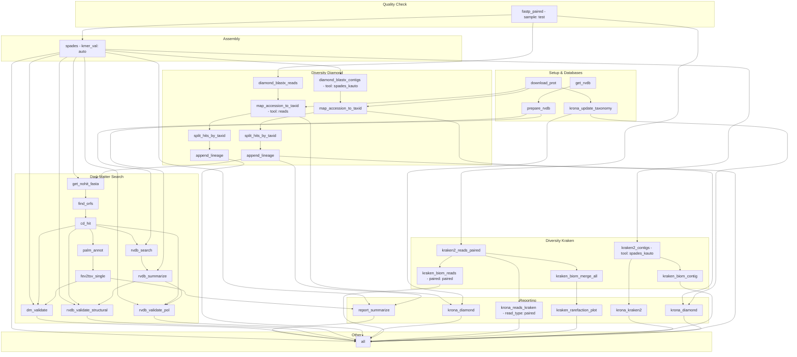

# 🇬🇧 DiscoVir Pipeline Structure (English)

Below is the detailed documentation of the directory and file structure of the DiscoVir pipeline, mapped based on the repository organization.

## 📊 Pipeline DAGs

### Pipeline Presentation

### Execution DAG (Slurm Profile)

---

## 📂 Root Directory (`/`)

*   **`DiscoVir.sh`**: The main wrapper script of the pipeline. It is responsible for receiving user parameters via the terminal, activating Conda environments, creating dynamic passing configurations, and triggering the Snakemake executor.
*   **`README.md`**: Main project documentation, containing usage instructions, requirements, structural schemes, and command options.
*   **`LICENSE`**: File with the software license legal terms (GPL v3).
*   **`accessions.txt`**: Text file where the user can list SRA accession codes (e.g., `SRR123456`) to process public data directly.
*   **`run_overrides.yaml`**: Dynamic configuration file generated by `DiscoVir.sh` at each run. It temporarily overrides key variables for Snakemake (such as absolute paths, step toggles, and working directory names).

---

## 📂 `config/`
Contains global static (non-dynamic) workflow configurations.
*   **`config.yaml`**: The core of technical options and refinements. It controls parameters such as K-mer sizes for SPAdes, E-value thresholds, Medaka base models, and fixed resources. Modifying it impacts rule execution details (unlike the general on/off toggles in the bash script).

---

## 📂 `workflow/`
The core "engine" and "brain" of the pipeline. All conditional logic, dependency routing, and mathematical flow analysis reside here.

*   **`Snakefile`**: The *master* entry file for Snakemake. It imports the `functions.py` module, aggregates dataset metadata, and triggers the inclusion of all other small rule scripts, in addition to defining the main scope (`rule all`).
*   **`multiqc_config.yaml`**: Template and visual layout definitions applied in consolidating the quality report via MultiQC.

### 📁 `workflow/envs/`
Defines software capsules and reproducible dependencies, building small specific Conda environments for each step.
*   *Examples*: Contains `yaml` files to isolate libraries for `spades`, `diamond`, `kraken2`, `palm_annot`, and R (`report`, `r_rarefaction`), ensuring no version conflicts.

### 📁 `workflow/rules/`
Snakemake code fragments (`.smk`). They divide the massive project into organized sub-modules triggered according to the `Toggles` provided by the user.
*   **`get_data.smk`**: Optimized SRA download via `fasterq-dump`.
*   **`fastp.smk`**: Strict cleaning (QC) of library adapters.
*   **`denovo.smk`**: Assembly logic using short/long read assemblers (SPAdes, Flye, Megahit, etc.).
*   **`diamond.smk` / `kraken2.smk` / `lineage.smk` / `megan.smk` / `basta.smk`**: Perform taxonomic alignments, k-mer identifications, and determine lineages by lowest common ancestor (LCA).
*   **`darkmatter.smk` / `RVDB.smk`**: Active search for ORFs, structural evaluations, hidden pattern detection, and viral HMM alignments.
*   **`reporting.smk` / `krona.smk`**: Consolidators. They merge raw tables to compose summaries for interactive multi-screen dashboards.

### 📁 `workflow/scripts/`
Hosts execution scripts triggered directly by Snakemake rules (under the `script:` tag).
*   **`functions.py`**: The central Python parser. Interprets input nature, dynamically decides the dependency graph topology, and calculates expected output folder branching.
*   **`dm_validate.py` / `palm_annot_run.py`**: Custom slicing, genetic clustering, and validation operations for "dark matter".
*   **`Report_Model.Rmd` / `generate_report.R`**: R processes responsible for elaborating the final interactive document (rich, statistical HTML) presented to the user at the end of the pipeline.

---

## 📂 `resources/`
Deposit directory for external dependencies, databases, or dynamic links and graphical assets.
*   **`diamond/` / `taxonomy/`**: Anchor points to house/point to heavy search database files.
*   **`palm_annot/`**: Houses the *Hidden Markov Models* (HMM) trained to classify structural RdRp domains necessary in "dark matter".
*   **`logo/`**: Base images structurally included for design in report renderings.

---

## 📂 `profiles/`
Contains Snakemake computational suitability "profiles".
*   **`local/`**: Instructs the engine to use resources simply on a local desktop computer.
*   **`profile_slurm/`**: Profile prepared for HPC (High Performance Computing). Delegates rules for mass submission using SLURM managers, individually limiting and scheduling memory, time, and partition requirements per rule.

---

## Other Directories
*   **`slurm_scripts/`**: Boilerplate examples (Slurm bash scripts `.slurm`) used by administrators to create dispatch queues on specific HPC systems (e.g., *crab*, *itrop*).
*   **`docs/`**: Extra documentation (such as `advanced-configuration-tutorial.md`) serving as tutorials and extra technical details for the platform.

 

 

# 🇧🇷 Estrutura do Pipeline DiscoVir (Português)

Abaixo está a documentação detalhada da estrutura de diretórios e arquivos do pipeline DiscoVir, mapeada com base na organização do repositório exibida pelo comando `tree`.

## 📂 Diretório Raiz (`/`)

*   **`DiscoVir.sh`**: O script principal (wrapper) do pipeline. É responsável por receber os parâmetros do usuário pelo terminal, ativar os ambientes Conda, criar as configurações dinâmicas de passagem e acionar o executor do Snakemake.
*   **`README.md`**: Documentação principal do projeto, contendo instruções de uso, requisitos, esquemas estruturais e opções de comando.
*   **`LICENSE`**: Arquivo com os termos legais da licença do software (GPL v3).
*   **`accessions.txt`**: Arquivo de texto onde o usuário pode listar códigos de acesso do SRA (ex: `SRR123456`) para processar diretamente dados públicos.
*   **`run_overrides.yaml`**: Arquivo de configuração dinâmico gerado pelo `DiscoVir.sh` a cada rodada. Ele subscreve temporariamente variáveis chaves para o Snakemake (como caminhos absolutos, ativação ou não de etapas, e nome do *workdir* de arrasto).

---

## 📂 `config/`
Contém as configurações globais estáticas (não dinâmicas) do fluxo de trabalho.
*   **`config.yaml`**: O coração das opções e refinamentos técnicos. Controla parâmetros como o tamanho de K-mers para o SPAdes, limiares de E-value, modelos base do Medaka e recursos fixos. Modificá-lo impacta detalhes do funcionamento das regras (diferentemente dos *toggles* gerais de ligar/desligar do script bash).

---

## 📂 `workflow/`
O motor e "cérebro" principal do pipeline. Toda a lógica condicional, rotas de dependência e análise matemática do fluxo reside aqui.

*   **`Snakefile`**: Arquivo *mestre* de entrada do Snakemake. Importa o módulo `functions.py`, agrega os metadados do dataset e engatilha a inclusão de todos os outros pequenos scripts de regras, além de definir o escopo principal (`rule all`).
*   **`multiqc_config.yaml`**: Template e definições de layout visual aplicados na consolidação do relatório de qualidade via MultiQC.

### 📁 `workflow/envs/`
Define as cápsulas de softwares e dependências reproduzíveis, construindo pequenos ambientes Conda específicos para cada passo.
*   *Exemplos*: Contém os `yaml` para isolar bibliotecas do `spades`, `diamond`, `kraken2`, `palm_annot`, e R (`report`, `r_rarefaction`), assegurando ausência de conflitos de versões.

### 📁 `workflow/rules/`
Fragmentos de código Snakemake (`.smk`). Eles dividem todo o projeto massivo em sub-módulos organizados e acionados de acordo com os `Toggles` informados pelo usuário.
*   **`get_data.smk`**: Download otimizado do SRA via `fasterq-dump`.
*   **`fastp.smk`**: Limpeza estrita (QC) de adaptadores das bibliotecas.
*   **`denovo.smk`**: Lógica de montagem utilizando montadores short/long reads (SPAdes, Flye, Megahit, etc).
*   **`diamond.smk` / `kraken2.smk` / `lineage.smk` / `megan.smk` / `basta.smk`**: Realizam alinhamentos taxonômicos, identificações de k-mers e determinam linhagens por ancestral comum mais recente (LCA).
*   **`darkmatter.smk` / `RVDB.smk`**: Busca ativa por ORFs, avaliações estruturais, detecção de padrões ocultos e alinhamentos HMM virais.
*   **`reporting.smk` / `krona.smk`**: Consolidadores. Juntam tabelas cruas para compor resumos para painéis multi-telas interativos.

### 📁 `workflow/scripts/`
Alojamento dos scripts de execução acionados diretamente pelas regras do Snakemake (sob a tag `script:`).
*   **`functions.py`**: O parser central em Python. Interpreta a natureza dos inputs, decide dinamicamente a topologia do grafo de dependências e calcula as ramificações de pastas esperadas no output.
*   **`dm_validate.py` / `palm_annot_run.py`**: Operações de retalho, agrupamentos genéticos e validações customizadas do "dark matter".
*   **`Report_Model.Rmd` / `generate_report.R`**: Processos em R responsáveis pela elaboração final do documento interativo (HTML rico e estatístico) apresentado ao final do pipeline ao usuário.

---

## 📂 `resources/`
Diretório de depósito para dependências externas, banco de dados ou links dinâmicos e ativos gráficos.
*   **`diamond/` / `taxonomy/`**: Pontos de ancoragem para abrigar/apontar os arquivos pesados de bancos de dados da busca.
*   **`palm_annot/`**: Abriga os *Modelos Ocultos de Markov* (HMM) treinados para classificar domínios RdRp estruturais necessários no "dark matter".
*   **`logo/`**: Imagens base incluídas estruturalmente para design nas renderizações de relatórios.

---

## 📂 `profiles/`
Contém os "perfis" de adequação computacional do Snakemake.
*   **`local/`**: Instrui a engrenagem a utilizar os recursos de forma singela num computador de mesa local.
*   **`profile_slurm/`**: Perfil preparado para HPC (High Performance Computing). Delega regras para envio massivo usando gerenciadores SLURM, limitando e escalonando requisitos em memória, tempo e partições por regra individualmente.

---

## Outros Diretórios
*   **`slurm_scripts/`**: Exemplos *boiler-plates* (Scripts em bash do Slurm `.slurm`) utilizados por administradores para criar filas de disparo em sistemas HPC específicos (ex. *crab*, *itrop*).
*   **`docs/`**: Documentações extras (tais como `advanced-configuration-tutorial.md`) servindo como tutoriais e detalhamentos técnicos extras à plataforma.

 

 

# 🇫🇷 Structure du Pipeline DiscoVir (Français)

Vous trouverez ci-dessous la documentation détaillée de l'arborescence et des fichiers du pipeline DiscoVir, cartographiée en fonction de l'organisation du dépôt.

## 📂 Répertoire Racine (`/`)

*   **`DiscoVir.sh`**: Le script principal (wrapper) du pipeline. Il est chargé de recevoir les paramètres de l'utilisateur via le terminal, d'activer les environnements Conda, de créer des configurations de passage dynamiques et de déclencher l'exécuteur Snakemake.
*   **`README.md`**: Documentation principale du projet, contenant les instructions d'utilisation, les prérequis, les schémas structurels et les options de commande.
*   **`LICENSE`**: Fichier contenant les termes légaux de la licence du logiciel (GPL v3).
*   **`accessions.txt`**: Fichier texte où l'utilisateur peut lister les codes d'accès SRA (ex: `SRR123456`) pour traiter directement des données publiques.
*   **`run_overrides.yaml`**: Fichier de configuration dynamique généré par `DiscoVir.sh` à chaque exécution. Il surcharge temporairement les variables clés pour Snakemake (telles que les chemins absolus, l'activation des étapes et les noms de répertoires de travail).

---

## 📂 `config/`
Contient les configurations globales statiques (non dynamiques) du flux de travail.
*   **`config.yaml`**: Le cœur des options et affinements techniques. Il contrôle des paramètres tels que la taille des K-mers pour SPAdes, les seuils E-value, les modèles de base Medaka et les ressources fixes. Sa modification impacte les détails d'exécution des règles (contrairement aux commutateurs généraux dans le script bash).

---

## 📂 `workflow/`
Le "moteur" et le "cerveau" principal du pipeline. Toute la logique conditionnelle, le routage des dépendances et l'analyse du flux mathématique résident ici.

*   **`Snakefile`**: Le fichier d'entrée *maître* pour Snakemake. Il importe le module `functions.py`, agrège les métadonnées des jeux de données et déclenche l'inclusion de tous les autres petits scripts de règles, en plus de définir la portée principale (`rule all`).
*   **`multiqc_config.yaml`**: Modèle et définitions de disposition visuelle appliqués dans la consolidation du rapport de qualité via MultiQC.

### 📁 `workflow/envs/`
Définit les capsules logicielles et les dépendances reproductibles, en construisant de petits environnements Conda spécifiques pour chaque étape.
*   *Exemples*: Contient les fichiers `yaml` pour isoler les bibliothèques pour `spades`, `diamond`, `kraken2`, `palm_annot` et R (`report`, `r_rarefaction`), garantissant l'absence de conflits de versions.

### 📁 `workflow/rules/`
Fragments de code Snakemake (`.smk`). Ils divisent le projet massif en sous-modules organisés et déclenchés selon les `Toggles` (commutateurs) fournis par l'utilisateur.
*   **`get_data.smk`**: Téléchargement optimisé SRA via `fasterq-dump`.
*   **`fastp.smk`**: Nettoyage strict (QC) des adaptateurs de bibliothèques.
*   **`denovo.smk`**: Logique d'assemblage utilisant des assembleurs de lectures courtes/longues (SPAdes, Flye, Megahit, etc.).
*   **`diamond.smk` / `kraken2.smk` / `lineage.smk` / `megan.smk` / `basta.smk`**: Effectuent les alignements taxonomiques, les identifications par k-mers et déterminent les lignées par le plus récent ancêtre commun (LCA).
*   **`darkmatter.smk` / `RVDB.smk`**: Recherche active d'ORF, évaluations structurelles, détection de motifs cachés et alignements HMM viraux.
*   **`reporting.smk` / `krona.smk`**: Consolidateurs. Ils fusionnent les tableaux bruts pour composer des résumés pour des tableaux de bord interactifs multi-écrans.

### 📁 `workflow/scripts/`
Héberge les scripts d'exécution déclenchés directement par les règles Snakemake (sous la balise `script:`).
*   **`functions.py`**: L'analyseur Python central. Il interprète la nature des entrées, décide dynamiquement de la topologie du graphe de dépendances et calcule la ramification attendue des dossiers de sortie.
*   **`dm_validate.py` / `palm_annot_run.py`**: Opérations de découpage personnalisées, de regroupement génétique et de validation pour la "matière noire" (dark matter).
*   **`Report_Model.Rmd` / `generate_report.R`**: Processus R responsables de l'élaboration du document interactif final (HTML riche et statistique) présenté à l'utilisateur à la fin du pipeline.

---

## 📂 `resources/`
Répertoire de dépôt pour les dépendances externes, les bases de données ou les liens dynamiques et actifs graphiques.
*   **`diamond/` / `taxonomy/`**: Points d'ancrage pour héberger/pointer vers les gros fichiers de base de données de recherche.
*   **`palm_annot/`**: Héberge les *Modèles de Markov Cachés* (HMM) formés pour classer les domaines structurels RdRp nécessaires dans la "matière noire".
*   **`logo/`**: Images de base incluses structurellement pour la conception dans les rendus de rapports.

---

## 📂 `profiles/`
Contient les "profils" d'adéquation computationnelle de Snakemake.
*   **`local/`**: Ordonne au moteur d'utiliser les ressources simplement sur un ordinateur de bureau local.
*   **`profile_slurm/`**: Profil préparé pour le calcul haute performance (HPC). Délègue les règles pour une soumission massive à l'aide des gestionnaires SLURM, en limitant et en planifiant individuellement la mémoire, le temps et les partitions par règle.

---

## Autres Répertoires
*   **`slurm_scripts/`**: Exemples de modèles (scripts bash Slurm `.slurm`) utilisés par les administrateurs pour créer des files d'attente d'envoi sur des systèmes HPC spécifiques (ex: *crab*, *itrop*).
*   **`docs/`**: Documentation supplémentaire (telle que `advanced-configuration-tutorial.md`) servant de tutoriels et de détails techniques supplémentaires pour la plateforme.
